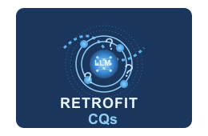
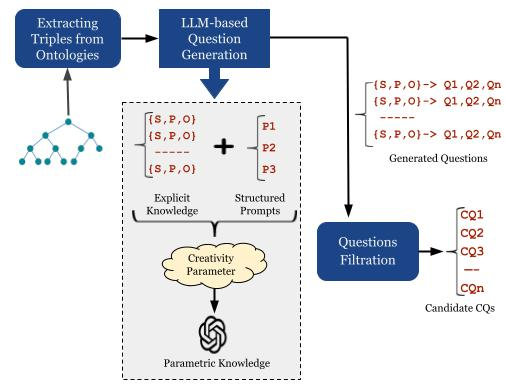

We introduce **RETROFIT-CQs**, a method for retrofitting CQs from existing ontologies by leveraging **Generative AI** and **LLMs**. CQs provide critical insights into the ontology’s scope and support tasks such as **ontology reuse**, **testing**, **requirement specification**, and **pattern definition**. Existing ontologies pose a challenge that supports **requirement elicitation**, **analysis**, and **testing**. However, the practice of not publishing CQs alongside ontologies can hinder the applicability of such tasks by other stakeholders. **RETROFIT-CQs** generate CQs from existing ontologies by utilizing the ontology’s **triples** and **LLMs** in the generation process. Adding retrofitted CQs to ontology documentation enhances it by including essential CQs often missing from published ontologies, thereby facilitating their use by third-party developers.


# RETROFIT-CQs steps:


**Extracting Triples from Ontologies:**  
This step involves parsing an ontology to generate statements as triples in the form (s, p, o). This process needs to be performed separately using **[DeepOnto]**(https://github.com/KRR-Oxford/DeepOnto) to extract ontology triples. **DeepOnto** contains an ontology projection module that simplifies the ontology structure by projecting it as a graph, avoiding blank nodes in complex ontology structures.

**LLM-based question generation:**  
We generate a set of prompts that instruct a **large language model (LLM)** to create queries related to the list of statements (triples) produced. In this explanation, we use the **GPT-4** model; however, this method is not limited to this model and has been tested with various **LLMs** (see related publication). Each LLM has its own settings that need to be adjusted accordingly.

**Question filtration:**  
One challenge that may be encountered when generating multiple queries for an LLM is the creation of several variants of the same question. This can be addressed by simply filtering out duplicate questions or by using **[SBERT]**(https://sbert.net/) with a threshold of 1 to remove duplications.

## Contact
- **Reham Alharbi** - [r.alharbi@liverpool.ac.uk](mailto:r.alharbi@liverpool.ac.uk)  
- **Valentina Tamma** - [valli@liverpool.ac.uk](mailto:valli@liverpool.ac.uk)

## Acknowledgement
This work is funded by a PhD studentship from **Taibah University, Saudi Arabia**, and the **Saudi Arabian Cultural Bureau in London (SACB)**.

## Citation
```bibtex
@inproceedings{RetrofitCQs,
  author = {Alharbi, Reham and Tamma, Valentina and Grasso, Floriana and Payne, Terry},
  title = {An Experiment in Retrofitting Competency Questions for Existing Ontologies},
  year = {2024},
  isbn = {9798400702433},
  publisher = {Association for Computing Machinery},
  address = {New York, NY, USA},
  url = {https://doi.org/10.1145/3605098.3636053},
  doi = {10.1145/3605098.3636053},
  booktitle = {Proceedings of the 39th ACM/SIGAPP Symposium on Applied Computing},
  pages = {1650–1658},
  numpages = {9},
  keywords = {ontology engineering, competency questions, large language models},
  location = {Avila, Spain},
  series = {SAC '24}
}


